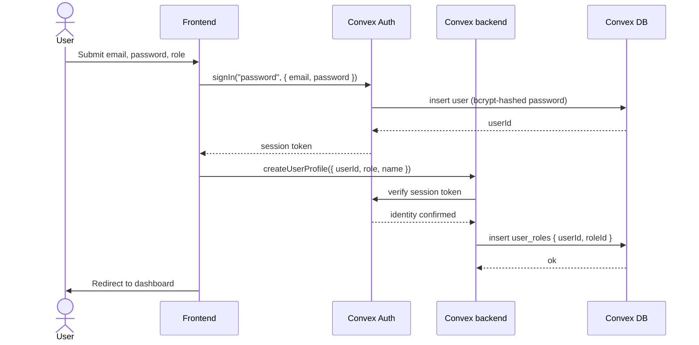

# Technical Requirements Document (TRD)
## Learning Management System (LMS)


## 1. Overall Description

### 1.1 Technology Stack

| Layer | Technology | 
|---|---|
| Frontend framework | Next.js (App Router) |
| Backend platform | Convex |
| Authentication | Convex Auth | 
| Language | TypeScript | 
| Styling | Tailwind CSS | 
| UI component library | shadcn/ui |
| File storage | Cloudflare R2 | 
| Frontend hosting | Vercel | 
| Backend hosting | Convex Cloud |

### 1.2 Assumptions

- All users access the system via a modern web browser. Mobile app support is out of scope for v1.
- Instructors upload media files directly from the browser via the teacher dashboard.
- Video files are served via CDN and streamed. The platform does not transcode video.
- The system operates in a single region in v1. Multi-region deployment is a future concern.
- Email notifications are out of scope for v1. No email provider integration is required.
- All time-related data is stored as UTC. Timezone conversion is handled client-side.

### 1.3 Constraints

- Convex's free tier limits apply during development. Production deployment requires a paid Convex plan.
- Convex mutations cannot call external APIs directly — this must be done via Actions.
- File uploads must be routed through Convex Actions (server-side) to keep storage credentials out of the browser.
- Next.js server components cannot use Convex client-side hooks (`useQuery`, `useMutation`). Server-side data fetching uses the Convex HTTP client.

### 1.4 Dependencies

| Dependency | Type | Impact if unavailable |
|---|---|---|
| Convex Cloud | Runtime (backend + DB) | Complete system outage |
| Vercel | Runtime (frontend) | Frontend unavailable; backend still functions |
| Cloudflare R2 | Runtime (file storage) | File uploads fail; existing URLs unaffected |
| Convex Auth | Runtime (auth) | Login and signup unavailable |

---

## 2. Functional Requirements

Requirements are written as verifiable technical statements. Each requirement maps to one or more acceptance criteria in Section 9.

Format: `REQ-[domain]-[number]: [component] must [behaviour] when [condition].`

### 2.1 User & Authentication

| ID | Requirement |
|---|---|
| REQ-AUTH-001 | The system must create a Convex Auth credential record and a `user_roles` row in a single sign-up flow. |
| REQ-AUTH-002 | The system must reject any mutation call that does not include a valid session token with an `Unauthenticated` error. |
| REQ-AUTH-003 | The system must reject any mutation call where the authenticated user lacks the required role with an `Unauthorized` error. |
| REQ-AUTH-004 | A user must be able to hold more than one role simultaneously (e.g. both `student` and `teacher`). Role membership is stored in `user_roles`, not as a scalar field on the user record. |
| REQ-AUTH-005 | The system must expose a `getUserProfile` query that returns profile fields and all assigned roles for a given `userId`. |
| REQ-USER-001 | A user must be able to update their `bio`, `expertise`, `experienceLevel`, `pfpUrl`, and `slug` via `updateUserProfile`. |
| REQ-USER-002 | User `slug` values must be unique across all users. The mutation must reject a slug that is already in use. |
| REQ-USER-003 | The system must expose a `getTeacherDirectory` query that returns all users with the `teacher` role, filterable by `expertise` and `experienceLevel`. |

### 2.2 Courses

| ID | Requirement |
|---|---|
| REQ-CRS-001 | A user with the `teacher` role must be able to create a course. Created courses must default to `status: "draft"` and must not appear in public listings. |
| REQ-CRS-002 | The `publishCourse` mutation must verify that every chapter in the course contains at least one lesson before setting `status: "published"`. It must return a specific error identifying empty chapters if the check fails. |
| REQ-CRS-003 | Course `slug` values must be unique across all courses. The mutation must reject a duplicate slug. |
| REQ-CRS-004 | A course must support multiple instructors via the `course_instructors` bridge table. The creating user is the owner; co-instructors may be added separately. |
| REQ-CRS-005 | The `getCourses` query must support pagination and accept optional filters for `categoryId`, `tagId`, `difficultyLevel`, and `status`. |
| REQ-CRS-006 | Only the course owner or a co-instructor may call `updateCourse`, `publishCourse`, or `createChapter` on a given course. |

### 2.3 Chapters & Lessons

| ID | Requirement |
|---|---|
| REQ-CHR-001 | Chapters must store an `index` field. The `courseId_index` compound index must enforce unique ordering per course. |
| REQ-LES-001 | Lessons must store an `index` field. The `chapterId_index` compound index must enforce unique ordering per chapter. |
| REQ-LES-002 | A lesson must be accessible only to users with an active enrollment in the parent course. `getLessonContent` must verify enrollment before returning content. |

### 2.4 Media files

| ID | Requirement |
|---|---|
| REQ-MED-001 | File uploads must be processed through a Convex Action. Storage credentials must never be exposed to the browser. |
| REQ-MED-002 | After a successful upload, the Action must write a row to `media_files` containing `lessonId`, `fileUrl`, `fileType`, `fileSize`, `fileName`, `isDownloadable`, and `index`. |
| REQ-MED-003 | The system must validate file MIME type server-side before initiating the upload. Extension-only checks are not sufficient. |
| REQ-MED-004 | File size limits must be enforced before upload: video ≤ 2 GB, PDF/slides ≤ 50 MB, images ≤ 10 MB, code files ≤ 5 MB. |
| REQ-MED-005 | A scheduled cleanup Action must run periodically to identify and flag orphaned files — files present in storage with no corresponding `media_files` row. |

### 2.5 Quizzes

| ID | Requirement |
|---|---|
| REQ-QZ-001 | A quiz must be attached to exactly one lesson via `lessonId`. |
| REQ-QZ-002 | Each question must have exactly one answer option with `isCorrect: true`. The `createAnswers` mutation must validate this constraint before inserting. |
| REQ-QZ-003 | The `submitQuiz` mutation must create a `quiz_attempts` row and one `user_answers` row per question. It must return the calculated score and the correct answers. |
| REQ-QZ-004 | `quiz_attempts` must record both `startedAt` and `completedAt` timestamps to enable detection of abandoned attempts. |
| REQ-QZ-005 | A student must not be able to submit a quiz they have already completed. The `userId_quizId` index must be used to check for an existing completed attempt. |

### 2.6 Assignments

| ID | Requirement |
|---|---|
| REQ-ASN-001 | An assignment may be attached to either a lesson (`lessonId`) or a chapter (`chapterId`). At least one must be set; the mutation must reject assignments with neither. |
| REQ-ASN-002 | A submission must support text, an external URL, and one or more uploaded files simultaneously. Files are stored in `submission_files`; text and URL are stored in `submissions`. |
| REQ-ASN-003 | Each resubmission must increment the `attemptNumber` field on the new `submissions` row. The `allowResubmission` flag on the assignment must be checked before accepting a resubmission. |
| REQ-ASN-004 | Only a user with the `teacher` or `evaluator` role may call `gradeSubmission`. The grader's `userId` must be written to `gradedBy` on the submission. |

### 2.7 Enrollments & Progress

| ID | Requirement |
|---|---|
| REQ-ENR-001 | A student must be enrolled in a course before they can access any lesson, attempt any quiz, or submit any assignment in that course. |
| REQ-ENR-002 | The `getEnrollments` query must return enrolled students with per-lesson completion data for a given course. It must be restricted to the course owner or a co-instructor. |
| REQ-PRG-001 | When a student completes a lesson, a `lesson_completions` row must be created. The `userId_lessonId` index must prevent duplicate completion records. |

### 2.8 Certificates

| ID | Requirement |
|---|---|
| REQ-CRT-001 | A certificate must be issued only when a student has completed all lessons, passed all required quizzes, and submitted all required assignments in a course. |
| REQ-CRT-002 | Each certificate must contain a unique `verificationCode`. Any visitor must be able to verify a certificate using only this code via a public query. |
| REQ-CRT-003 | Certificates must be downloadable as PDF. Generation is handled by a Convex Action. |

### 2.9 Batches

| ID | Requirement |
|---|---|
| REQ-BAT-001 | A batch must support multiple assigned instructors via the `batch_instructors` bridge table. |
| REQ-BAT-002 | Batch status must be one of `upcoming`, `active`, or `completed` enforced at the schema level using `v.union(v.literal(...))`. |
| REQ-BAT-003 | Enrolling a student in a batch must automatically enroll them in all courses associated with that batch via `batch_courses`. |

---

## 3. System Architecture & Design

### 3.1 Architecture Overview

The application follows a four-layer architecture: client, backend, data, and storage.

```
Browser
  └── Next.js Application (Vercel)
        ├── Server Components    → SSR for public/SEO pages
        └── Client Components    → Reactive dashboards via Convex SDK (WebSocket)
              └── Convex Backend (Convex Cloud)
                    ├── Queries      → Read-only, reactive, cached
                    ├── Mutations    → Transactional writes with validation
                    └── Actions      → External integrations (file storage, PDF gen)
                          ├── Convex Database   → All structured application data
                          └── Cloudflare R2     → Binary assets (video, PDF, images)
```


### 3.2 Project Structure

```
project-root/
│
├── docs/
│   ├── PRD.md
│   └── TRD.md
│
├── app/                           # Next.js App Router
│   ├── (public)/                  # Unauthenticated routes
│   │   ├── courses/
│   │   └── teachers/
│   ├── (auth)/                    # Sign-in / sign-up
│   └── (app)/                     # Authenticated routes
│       ├── student/
│       └── teacher/
│
├── components/
│   ├── ui/                        # shadcn/ui primitives
│   ├── course/                    # Course-specific components
│   ├── quiz/                      # Quiz player, quiz builder
│   └── layout/                    # App shell, nav, sidebar
│
├── convex/
│   ├── schema.ts                  # Single source of truth for DB types
│   ├── auth.config.ts             # Convex Auth configuration
│   ├── users/
│   │   ├── queries.ts
│   │   └── mutations.ts
│   ├── courses/
│   │   ├── queries.ts
│   │   └── mutations.ts
│   ├── chapters/
│   │   ├── queries.ts
│   │   └── mutations.ts
│   ├── lessons/
│   │   ├── queries.ts
│   │   └── mutations.ts
│   ├── quizzes/
│   │   ├── queries.ts
│   │   └── mutations.ts
│   ├── assignments/
│   │   ├── queries.ts
│   │   └── mutations.ts
│   ├── enrollments/
│   │   ├── queries.ts
│   │   └── mutations.ts
│   └── storage/
│       └── actions.ts             # uploadMedia, deleteMedia, cleanupOrphans
│
└── lib/
    ├── utils.ts
    └── validators.ts              # Shared Zod / Convex validators
```

---

## 4. Technical Specifications

### 4.1 Environment Setup

**Prerequisites**

| Tool | Minimum version |
|---|---|
| Node.js | 18.x |
| npm or pnpm | npm 9+ / pnpm 8+ |
| Convex CLI | Latest (`npm i -g convex`) |

```

### 4.2 Authentication & Authorization

Authentication is handled by Convex Auth (email + password in v1). Sign-up is a two-step flow: credentials are created by Convex Auth, then a separate mutation creates the user profile and assigns the initial role.

**Why two steps?** The Convex Auth user record (`users` table, auth layer) is separate from the application profile (also `users` table, extended fields). Keeping the credential record and the profile creation separate means the auth layer can be swapped or extended without affecting profile logic.

**Sign-up sequence**



**Role and permission matrix**

| Role | Create course | Manage own course | Grade submissions | View all students | Enroll in course |
|---|---|---|---|---|---|
| Student | — | — | — | — | Yes |
| Teacher | Yes | Yes | Yes | Own courses only | Yes |
| Evaluator | — | — | Yes (assigned) | Assigned courses | Yes |
| Moderator | — | — | — | — | Yes |

**Authorization pattern — applied in every protected mutation**

```typescript
export const createCourse = mutation({
  args: { title: v.string(), description: v.string() },
  handler: async (ctx, args) => {
    // 1. Auth check
    const userId = await getAuthUserId(ctx);
    if (!userId) throw new ConvexError("Unauthenticated");

    // 2. Role check
    const isTeacher = await hasUserRole(ctx, userId, "teacher");
    if (!isTeacher) throw new ConvexError("Unauthorized");

    // 3. Input validation
    if (args.title.trim().length < 3)
      throw new ConvexError("Title must be at least 3 characters");

    // 4. Business rule check
    const existing = await ctx.db
      .query("courses")
      .withIndex("userId_title", q =>
        q.eq("userId", userId).eq("title", args.title))
      .first();
    if (existing) throw new ConvexError("A course with this title already exists");

    // 5. Write
    return await ctx.db.insert("courses", {
      ...args, userId, status: "draft",
      createdAt: Date.now(), updatedAt: Date.now()
    });
  }
});
```

### 4.3 Data Model

The schema is defined in `convex/schema.ts`. All tables follow these conventions:

- Primary key: Convex-generated `_id`
- Timestamps: `createdAt` and `updatedAt` stored as `number` (Unix ms)
- Soft delete: `deletedAt: v.optional(v.number())` — queries filter `deletedAt === undefined` by default
- Status fields: typed as `v.union(v.literal(...))` to prevent invalid values at compile time
- Indexes: defined for every foreign key and every field used in a `where` clause

**Schema entity groups**

| Group | Tables |
|---|---|
| User system | `users`, `roles`, `user_roles`, `schedules` |
| Course system | `courses`, `course_instructors`, `chapters`, `lessons`, `media_files` |
| Learning participation | `enrollments`, `lesson_completions` |
| Quiz system | `quizzes`, `q_questions`, `q_answers`, `quiz_attempts`, `user_answers` |
| Assignment system | `assignments`, `submissions`, `submission_files` |
| Course organisation | `categories`, `course_categories`, `tags`, `course_tags` |
| Batches | `batches`, `batch_instructors`, `batch_students`, `batch_courses` |
| Certification | `certificates` |
| Reviews *(v2)* | `reviews` |

### 4.4 Backend Function Reference

**Users**

| Function | Type | Auth required | Description |
|---|---|---|---|
| `getUserProfile` | query | Any authenticated user | Returns profile + all roles for a userId |
| `getTeacherDirectory` | query | Public | Returns all teacher-role users with optional filters |
| `createUserProfile` | mutation | Authenticated (self) | Creates profile, assigns initial role |
| `updateUserProfile` | mutation | Authenticated (self) | Updates bio, expertise, availability, slug |

**Courses**

| Function | Type | Auth required | Description |
|---|---|---|---|
| `getCourses` | query | Public | Paginated, filterable published course list |
| `getCoursesByTeacher` | query | Teacher (self) | All courses owned by the authenticated teacher |
| `getCourseDetails` | query | Public (published) / Owner | Full course with chapters and lessons |
| `createCourse` | mutation | Teacher | Creates course at `draft` status |
| `updateCourse` | mutation | Owner or co-instructor | Updates course fields |
| `publishCourse` | mutation | Owner | Validates completeness, sets `published` |
| `archiveCourse` | mutation | Owner | Sets `archived`, removes from public listing |

**Chapters & Lessons**

| Function | Type | Auth required | Description |
|---|---|---|---|
| `createChapter` | mutation | Owner or co-instructor | Inserts chapter with `index` |
| `reorderChapters` | mutation | Owner or co-instructor | Updates `index` on multiple chapters atomically |
| `createLesson` | mutation | Owner or co-instructor | Inserts lesson with `index` |
| `getLessonContent` | query | Enrolled student or owner | Returns lesson + media files |

**Quizzes**

| Function | Type | Auth required | Description |
|---|---|---|---|
| `getQuizByLesson` | query | Enrolled student or owner | Returns quiz with questions and answers |
| `createQuiz` | mutation | Owner or co-instructor | Creates quiz attached to a lesson |
| `createQuestion` | mutation | Owner or co-instructor | Adds question with options |
| `submitQuiz` | mutation | Enrolled student | Records attempt, returns score and correct answers |

**Assignments**

| Function | Type | Auth required | Description |
|---|---|---|---|
| `getAssignmentsByLesson` | query | Enrolled student or owner | Returns assignments for a lesson or chapter |
| `createAssignment` | mutation | Owner or co-instructor | Creates assignment |
| `submitAssignment` | mutation | Enrolled student | Creates submission, links files |
| `gradeSubmission` | mutation | Teacher or evaluator | Sets score, feedback, `gradedBy` |

**Storage**

| Function | Type | Auth required | Description |
|---|---|---|---|
| `uploadMedia` | action | Owner or co-instructor | PUTs file to R2, inserts `media_files` row |
| `deleteMedia` | action | Owner or co-instructor | Removes from R2, soft-deletes DB record |
| `cleanupOrphanedFiles` | action | System (scheduled) | Reconciles R2 objects against `media_files` |

### 4.5 File Storage Design

Files are never uploaded directly from the browser to storage. All uploads go through a Convex Action so that credentials remain server-side.

**Upload flow**

```
Browser selects file
  → uploadMedia Action called
    → MIME type validated server-side
    → File size checked against limits
    → PUT to Cloudflare R2
      → fileUrl returned
        → insert media_files { lessonId, fileUrl, fileType, fileSize, ... }
          → confirmed to browser
```

**File size limits**

| File type | Max size | Delivery method |
|---|---|---|
| Video | 2 GB | CDN streaming |
| PDF / slides | 50 MB | Inline viewer or download |
| Images | 10 MB | CDN |
| Code files | 5 MB | Direct download |

**Orphaned file handling**

A file becomes orphaned when the PUT to R2 succeeds but the subsequent `media_files` insert fails. The `cleanupOrphanedFiles` Action runs on a schedule, lists all objects in the R2 bucket, cross-references against `media_files`, and flags any unmatched objects for review or deletion.

### 4.6 Error Handling Strategy

**Error taxonomy**

| Error type | Equivalent HTTP | When to throw |
|---|---|---|
| `Unauthenticated` | 401 | No valid session token |
| `Unauthorized` | 403 | Valid session, role check failed |
| `ValidationError` | 400 | Input fails schema or business rule |
| `NotFound` | 404 | Queried document does not exist |
| `ConflictError` | 409 | Unique constraint violation (duplicate slug, etc.) |
| `ServerError` | 500 | Unexpected failure — log and re-throw |

**Backend pattern** — all mutations follow this structure:

```typescript
// 1. Auth check → 2. Role check → 3. Input validation → 4. Business rule → 5. Write
const userId = await getAuthUserId(ctx);
if (!userId) throw new ConvexError("Unauthenticated");
// ... (see Section 8.2 for full example)
```

**Frontend pattern** — errors are caught and displayed inline:

```typescript
try {
  const courseId = await createCourse({ title, description });
  router.push(`/teacher/courses/${courseId}/edit`);
} catch (err) {
  if (err instanceof ConvexError) {
    setError(err.message); // display inline, do not crash
  } else {
    setError("Something went wrong. Please try again.");
  }
}
```

---

## 5. Acceptance Criteria & Test Plan

Each acceptance criterion maps to one or more functional requirements from Section 5. A feature is considered complete only when all of its ACs pass.

### 5.1 Authentication & User Management

| ID | Requirement | Pass condition |
|---|---|---|
| AC-AUTH-001 | REQ-AUTH-001 | Submitting a valid email and password creates both a Convex Auth credential and a `user_roles` row in the same sign-up request. Querying `getUserProfile` immediately after sign-up returns the correct role. |
| AC-AUTH-002 | REQ-AUTH-002 | Calling any protected mutation without a session token returns a `ConvexError` with message `"Unauthenticated"`. The DB is not written to. |
| AC-AUTH-003 | REQ-AUTH-003 | Calling `createCourse` as a student-only user returns `ConvexError "Unauthorized"`. The `courses` table is unchanged. |
| AC-AUTH-004 | REQ-AUTH-004 | A single user can have both `student` and `teacher` rows in `user_roles`. `getUserProfile` returns both roles. |
| AC-USER-001 | REQ-USER-002 | Creating two users with the same slug returns a conflict error on the second attempt. The first user's slug is unchanged. |
| AC-USER-002 | REQ-USER-003 | `getTeacherDirectory` returns only users with the `teacher` role. Filtering by `expertise: "Python"` returns only teachers whose `expertise` array includes `"Python"`. |

### 5.2 Course Lifecycle

| ID | Requirement | Pass condition |
|---|---|---|
| AC-CRS-001 | REQ-CRS-001 | A newly created course has `status: "draft"`. It does not appear in the results of `getCourses` when called without an owner session. |
| AC-CRS-002 | REQ-CRS-002 | Calling `publishCourse` on a course with one empty chapter returns a `ConvexError` that names the empty chapter. Course status remains `"draft"`. |
| AC-CRS-003 | REQ-CRS-002 | Calling `publishCourse` on a course where every chapter has at least one lesson sets `status: "published"`. The course appears in `getCourses`. |
| AC-CRS-004 | REQ-CRS-006 | A teacher who is not the owner or a co-instructor of a course receives `Unauthorized` when calling `updateCourse`. |

### 5.3 Media Upload

| ID | Requirement | Pass condition |
|---|---|---|
| AC-MED-001 | REQ-MED-001 | The browser never receives or sends storage credentials. Network inspection during an upload shows only requests to the Convex backend, not directly to R2. |
| AC-MED-002 | REQ-MED-002 | After a successful upload, a row exists in `media_files` with the correct `lessonId`, `fileUrl`, `fileType`, `fileSize`, and `isDownloadable` values. |
| AC-MED-003 | REQ-MED-003 | Uploading a `.jpg` file with `Content-Type: application/pdf` is rejected server-side with a MIME validation error. |
| AC-MED-004 | REQ-MED-004 | Attempting to upload a video file larger than 2 GB is rejected before any bytes are sent to R2. |

### 5.4 Quiz System

| ID | Requirement | Pass condition |
|---|---|---|
| AC-QZ-001 | REQ-QZ-002 | Calling `createAnswers` with zero options marked `isCorrect: true` returns a validation error. No rows are inserted into `q_answers`. |
| AC-QZ-002 | REQ-QZ-002 | Calling `createAnswers` with two options marked `isCorrect: true` returns a validation error. No rows are inserted. |
| AC-QZ-003 | REQ-QZ-003 | After `submitQuiz`, a `quiz_attempts` row exists with the correct `score`. One `user_answers` row exists per question in the quiz. The response includes the correct answers. |
| AC-QZ-004 | REQ-QZ-005 | Calling `submitQuiz` a second time on an already-completed attempt returns a conflict error. No new `quiz_attempts` row is created. |

### 5.5 Assignments & Submissions

| ID | Requirement | Pass condition |
|---|---|---|
| AC-ASN-001 | REQ-ASN-001 | Calling `createAssignment` with neither `lessonId` nor `chapterId` returns a validation error. |
| AC-ASN-002 | REQ-ASN-002 | A submission with text, a URL, and two uploaded files creates one `submissions` row and two `submission_files` rows. |
| AC-ASN-003 | REQ-ASN-003 | Calling `submitAssignment` on an assignment with `allowResubmission: false` when a completed submission already exists returns an error. |
| AC-ASN-004 | REQ-ASN-003 | A valid resubmission creates a new `submissions` row with `attemptNumber` incremented. The previous submission is not modified. |
| AC-ASN-005 | REQ-ASN-004 | A user with only the `student` role calling `gradeSubmission` receives `Unauthorized`. The submission is unchanged. |

### 5.6 Enrollment & Access Control

| ID | Requirement | Pass condition |
|---|---|---|
| AC-ENR-001 | REQ-ENR-001, REQ-LES-002 | Calling `getLessonContent` for a lesson in a course where the user has no enrollment row returns `Unauthorized`. |
| AC-ENR-002 | REQ-ENR-001 | After enrolling, calling `getLessonContent` for the same lesson returns the lesson content and its media files. |
| AC-ENR-003 | REQ-ENR-002 | A teacher calling `getEnrollments` for a course they do not own receives `Unauthorized`. |

### 5.7 Certificates

| ID | Requirement | Pass condition |
|---|---|---|
| AC-CRT-001 | REQ-CRT-002 | Calling the public certificate verification query with a valid `verificationCode` returns the student name, course name, and completion date. |
| AC-CRT-002 | REQ-CRT-002 | Calling the verification query with an invalid or tampered code returns not found. |

---

## 6. Glossary & Appendix

### 6.1 Future Improvements

Features explicitly deferred to post-v1, with notes on schema and infrastructure impact.

| Feature | Schema impact | Implementation notes |
|---|---|---|
| Course ratings & reviews | `reviews` table already defined | UI, query, and aggregation not built in v1 |
| Paid courses / payments | `courses` needs `price` and `currency` fields | Stripe integration via Convex Action |
| Social login (Google, GitHub) | No schema change | Convex Auth config change only |
| Discussion forums | New `threads` and `posts` tables | — |
| Email notifications | No schema change | Convex Action + Resend or similar |
| Admin management panel | No schema change | New `(admin)/` route group |
| Mobile application | No backend change | Convex SDK supports React Native |
| AI course recommendations | No schema change | New Action calling an LLM API |
| Live classroom sessions | Significant new infrastructure | e.g. LiveKit integration |
| Learning analytics dashboard | No schema change | Aggregation queries on existing tables |

---